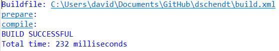
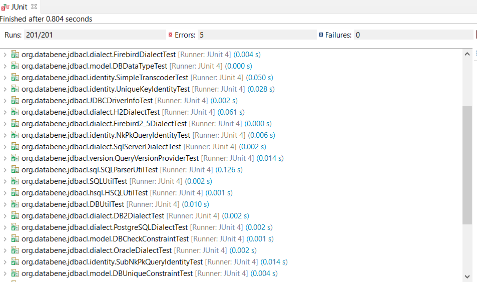
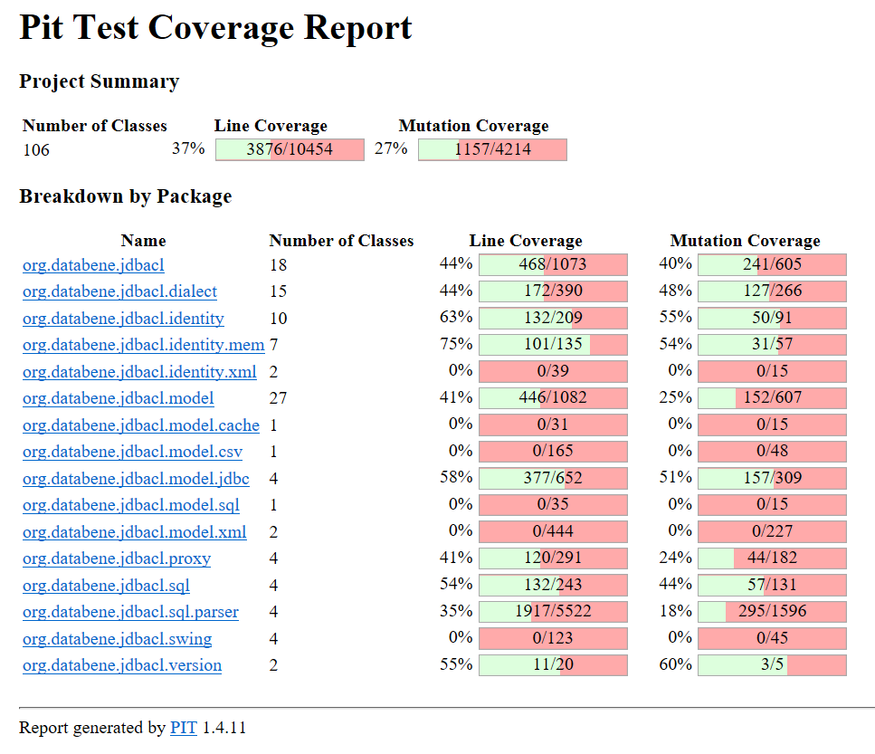
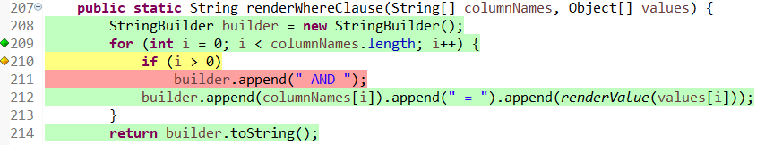
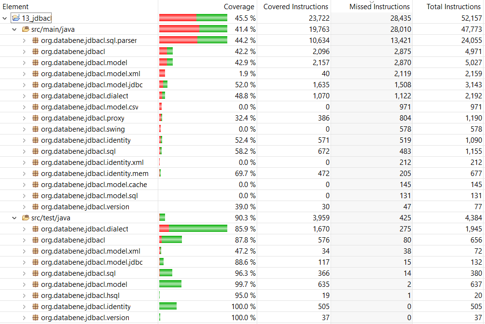
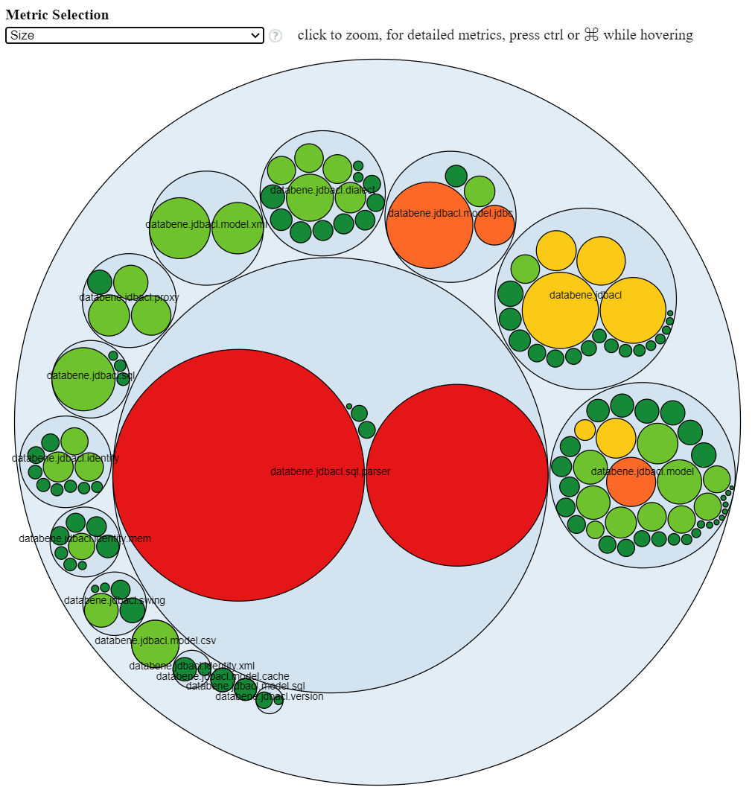

# Setup
1. Create directory: C:\Users\USERNAME\databene
2. Select build.xml in Project Explorer
 *Right-click and select Run As
 *Select "1 Ant Build"
3. Add an empty "test.env.properties" file to directory: C:\Users\USERNAME\databene

3. Verify everything is running properly by executing the test
 *Select src/test/java in Project Explorer
 *Right-click and select Run As
 *Select "JUnit Test"

# Artifacts
1. Comment in Main.java says it retrieves meta data from a database and prints it to the console in a tree structure.
2. Comment in DBUtil.java says it provides database utility methods.
3. Comment in QueryDataIterator.java says it's DataIterator method provides results of a SQL query.
4. Comment in SQLUtil.java says it provides methods for creating SQL queries and commands.
5. Several comments refer to JDBC databases (Java Database Connectivity) so it must be for use with them.

Overall it seems the code provides various utilities related to JDBC databases. It has utilites for creating SQL commands and queries, connecting to databases, retrieving metadata, and parsing SQL queries. It has various tests for various SQL dialects such as SQL Server, Firebird, Postgre SQL, Oracle, and HSQL.

# Initial Analysis

## Pitest
Pitest is a tool that provides mutation testing on your test suite. It breaksdown how many of the mutations were caught and even provides a detailed list of all mutations made, which were caught, and which were not.

## EclEmma
EclEmma is a tool that provides details on the coverage of your test suite. It gives you a detailed brakedown of how many lines were and were not covered by your test suite. It allows you to go further and see which lines in each file have been executed (green), when not all branches were covered (yellow), and which lines were not executed (red). 

This gives a lot of insight into what the developers thought to be most import/what is likely the core funtionality of the project. In this case ~43% of all the lines covered by the test suite were in org.databene.jdbacl.sql.parser and ~70% of that (or ~31% of the total coverage) was in the file SQLParser.java. The next largest individual files tested (by cover lines) was DBUtil.java and SQLUtil.java.

This supports my original thought that the main function of this project is to provide general SQL utilities and query and command helper funtionality.

## CodeMR
CodeMR generates a bunch of data and reports on your code base. It's easy to get lost in all of them and especially when trying to figure out what each tells you. Thankfully, there is some information that is easier to access and learn from. At the top of the main report, there is a section for titled "Analysis of your PROJECTNAME" and this give sa quick breakdown of the project. 

Clicking on "number of highly problematic classes" takes you to a report with a more detailed breakdown of the coupling, complexity, cohesion, and size of all the classes in your project. In my project, there were 3 highly problematic classes. Highly problematic being defined as high coupling, high complexity, and low cohesion. We can see that based purely on size SQLParse and SQLLexer are the two largest classes by a very large margin with the two taking up nearly half of the total lines of code in the project. Next, the most coupled classes in the project are the database importer (JDBCDBImporter), DBUtil, and SQLParserUtil. 

This all seems to support the idea I had that the main functionality of this project is to provide utilities relating to databases, such as building and parsing SQL queries.

# Test Plan

## Senario 1
A user uses this to connect to a database with a SQL version that is newer than what is supported.

What to test: Get Version Functionality, SQL Parsing
Why: It would be understandable that if in the future someone was still using this and tried to use it on a new version of a dialect or SQL then it should properly handle as much as it can and be able to alert the user that the version of the dialect or SQL they are trying to use with it aren't supported.
Inputs: Mocked up SQL messages giving a version of SQL/dialect that doesn't exist.

## Senario 2
A user tries to connect to a database with improper credentials.

What to test: DB Connection
Why: A user could easily mistype a password or username when trying to connect to a JDBC. Handling this in an elegant way that alerts the user it wasn't able to connect due to bad credentials and then allowing them to try again would we ideal.
Inputs: Connection url, username, password

